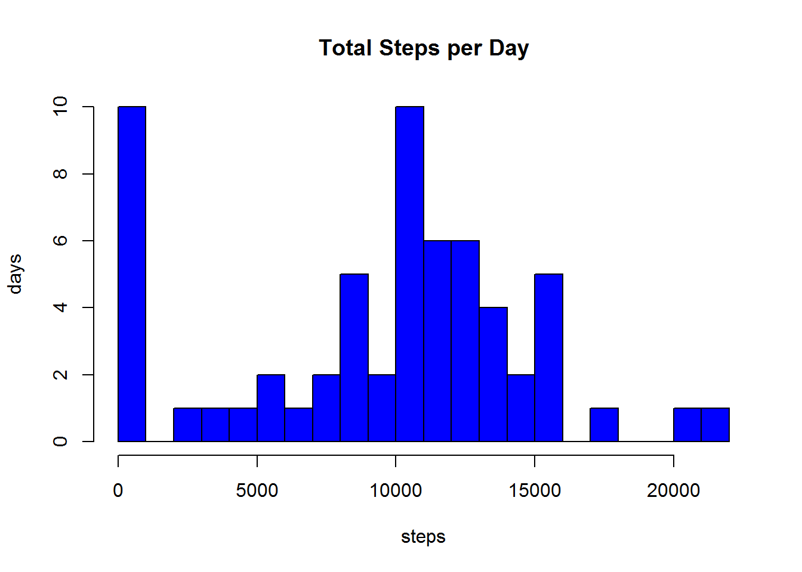
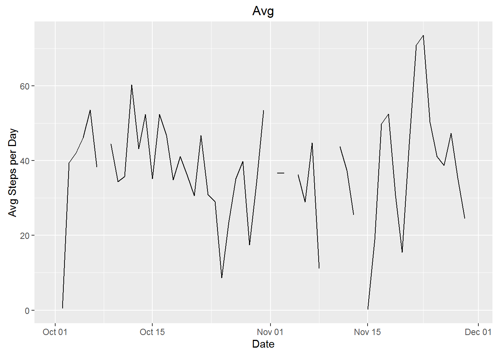
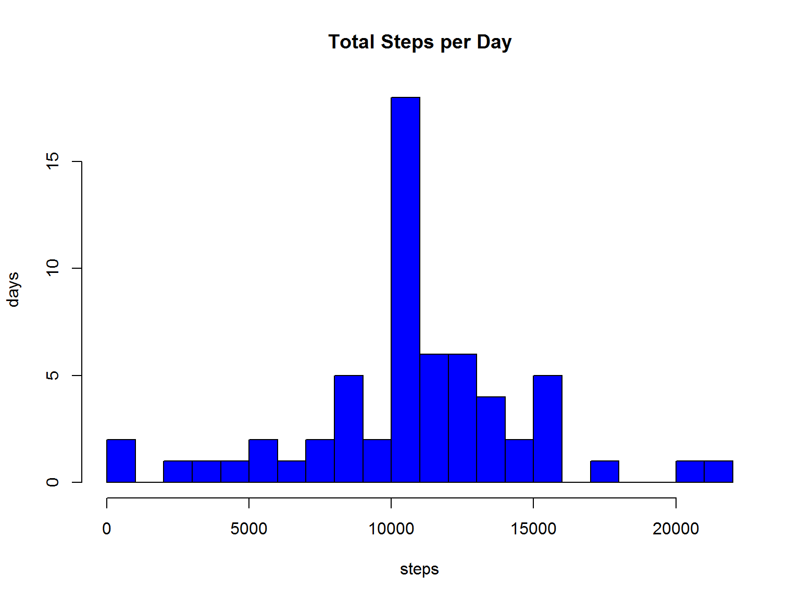
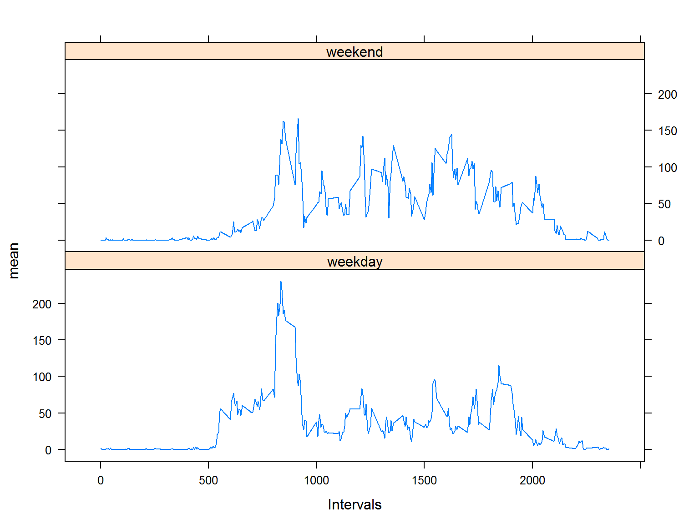

## Reproducible Research: Peer Assessment 1


### Loading and preprocessing the data

*Get the data from the activity.csv file and set to data frame*

```r
#assumes in working directory
setwd("C://Users//Jim//Documents//Coursera//Reproducible_Research//RepData_PeerAssessment1")
DataActTemp <- read.csv("activity.csv",as.is=TRUE)
```

### Determining the mean total number of steps taken per day

*the R Code*

```r
## Calculating the total number of steps taken per day
# first split the file by Date
DataActSplit <- split(DataActTemp$steps,DataActTemp$date)

#calculate total steps per day using sapply and ignoring missing data
TotSteps <- sapply(DataActSplit,sum,na.rm=TRUE)

#create a data frame to hod the total steps data
totDF <- data.frame(TotalSteps=TotSteps)
library(xtable)
```

```
## Warning: package 'xtable' was built under R version 3.2.3
```

```r
# use xtable to create a data table
tab1 <- xtable(totDF,caption="Total Steps per Day")
```
### Total number of steps taken per day

```r
print(tab1, caption.placement='top',type="html")
```

<!-- html table generated in R 3.2.0 by xtable 1.8-2 package -->
<!-- Fri Feb 26 22:09:54 2016 -->
<table border=1>
<caption align="top"> Total Steps per Day </caption>
<tr> <th>  </th> <th> TotalSteps </th>  </tr>
  <tr> <td align="right"> 2012-10-01 </td> <td align="right">   0 </td> </tr>
  <tr> <td align="right"> 2012-10-02 </td> <td align="right"> 126 </td> </tr>
  <tr> <td align="right"> 2012-10-03 </td> <td align="right"> 11352 </td> </tr>
  <tr> <td align="right"> 2012-10-04 </td> <td align="right"> 12116 </td> </tr>
  <tr> <td align="right"> 2012-10-05 </td> <td align="right"> 13294 </td> </tr>
  <tr> <td align="right"> 2012-10-06 </td> <td align="right"> 15420 </td> </tr>
  <tr> <td align="right"> 2012-10-07 </td> <td align="right"> 11015 </td> </tr>
  <tr> <td align="right"> 2012-10-08 </td> <td align="right">   0 </td> </tr>
  <tr> <td align="right"> 2012-10-09 </td> <td align="right"> 12811 </td> </tr>
  <tr> <td align="right"> 2012-10-10 </td> <td align="right"> 9900 </td> </tr>
  <tr> <td align="right"> 2012-10-11 </td> <td align="right"> 10304 </td> </tr>
  <tr> <td align="right"> 2012-10-12 </td> <td align="right"> 17382 </td> </tr>
  <tr> <td align="right"> 2012-10-13 </td> <td align="right"> 12426 </td> </tr>
  <tr> <td align="right"> 2012-10-14 </td> <td align="right"> 15098 </td> </tr>
  <tr> <td align="right"> 2012-10-15 </td> <td align="right"> 10139 </td> </tr>
  <tr> <td align="right"> 2012-10-16 </td> <td align="right"> 15084 </td> </tr>
  <tr> <td align="right"> 2012-10-17 </td> <td align="right"> 13452 </td> </tr>
  <tr> <td align="right"> 2012-10-18 </td> <td align="right"> 10056 </td> </tr>
  <tr> <td align="right"> 2012-10-19 </td> <td align="right"> 11829 </td> </tr>
  <tr> <td align="right"> 2012-10-20 </td> <td align="right"> 10395 </td> </tr>
  <tr> <td align="right"> 2012-10-21 </td> <td align="right"> 8821 </td> </tr>
  <tr> <td align="right"> 2012-10-22 </td> <td align="right"> 13460 </td> </tr>
  <tr> <td align="right"> 2012-10-23 </td> <td align="right"> 8918 </td> </tr>
  <tr> <td align="right"> 2012-10-24 </td> <td align="right"> 8355 </td> </tr>
  <tr> <td align="right"> 2012-10-25 </td> <td align="right"> 2492 </td> </tr>
  <tr> <td align="right"> 2012-10-26 </td> <td align="right"> 6778 </td> </tr>
  <tr> <td align="right"> 2012-10-27 </td> <td align="right"> 10119 </td> </tr>
  <tr> <td align="right"> 2012-10-28 </td> <td align="right"> 11458 </td> </tr>
  <tr> <td align="right"> 2012-10-29 </td> <td align="right"> 5018 </td> </tr>
  <tr> <td align="right"> 2012-10-30 </td> <td align="right"> 9819 </td> </tr>
  <tr> <td align="right"> 2012-10-31 </td> <td align="right"> 15414 </td> </tr>
  <tr> <td align="right"> 2012-11-01 </td> <td align="right">   0 </td> </tr>
  <tr> <td align="right"> 2012-11-02 </td> <td align="right"> 10600 </td> </tr>
  <tr> <td align="right"> 2012-11-03 </td> <td align="right"> 10571 </td> </tr>
  <tr> <td align="right"> 2012-11-04 </td> <td align="right">   0 </td> </tr>
  <tr> <td align="right"> 2012-11-05 </td> <td align="right"> 10439 </td> </tr>
  <tr> <td align="right"> 2012-11-06 </td> <td align="right"> 8334 </td> </tr>
  <tr> <td align="right"> 2012-11-07 </td> <td align="right"> 12883 </td> </tr>
  <tr> <td align="right"> 2012-11-08 </td> <td align="right"> 3219 </td> </tr>
  <tr> <td align="right"> 2012-11-09 </td> <td align="right">   0 </td> </tr>
  <tr> <td align="right"> 2012-11-10 </td> <td align="right">   0 </td> </tr>
  <tr> <td align="right"> 2012-11-11 </td> <td align="right"> 12608 </td> </tr>
  <tr> <td align="right"> 2012-11-12 </td> <td align="right"> 10765 </td> </tr>
  <tr> <td align="right"> 2012-11-13 </td> <td align="right"> 7336 </td> </tr>
  <tr> <td align="right"> 2012-11-14 </td> <td align="right">   0 </td> </tr>
  <tr> <td align="right"> 2012-11-15 </td> <td align="right">  41 </td> </tr>
  <tr> <td align="right"> 2012-11-16 </td> <td align="right"> 5441 </td> </tr>
  <tr> <td align="right"> 2012-11-17 </td> <td align="right"> 14339 </td> </tr>
  <tr> <td align="right"> 2012-11-18 </td> <td align="right"> 15110 </td> </tr>
  <tr> <td align="right"> 2012-11-19 </td> <td align="right"> 8841 </td> </tr>
  <tr> <td align="right"> 2012-11-20 </td> <td align="right"> 4472 </td> </tr>
  <tr> <td align="right"> 2012-11-21 </td> <td align="right"> 12787 </td> </tr>
  <tr> <td align="right"> 2012-11-22 </td> <td align="right"> 20427 </td> </tr>
  <tr> <td align="right"> 2012-11-23 </td> <td align="right"> 21194 </td> </tr>
  <tr> <td align="right"> 2012-11-24 </td> <td align="right"> 14478 </td> </tr>
  <tr> <td align="right"> 2012-11-25 </td> <td align="right"> 11834 </td> </tr>
  <tr> <td align="right"> 2012-11-26 </td> <td align="right"> 11162 </td> </tr>
  <tr> <td align="right"> 2012-11-27 </td> <td align="right"> 13646 </td> </tr>
  <tr> <td align="right"> 2012-11-28 </td> <td align="right"> 10183 </td> </tr>
  <tr> <td align="right"> 2012-11-29 </td> <td align="right"> 7047 </td> </tr>
  <tr> <td align="right"> 2012-11-30 </td> <td align="right">   0 </td> </tr>
   </table>

### Histogram of the total number of steps taken each day

```r
hist(TotSteps,col="blue",xlab="steps",ylab="days",main="Total Steps per Day",breaks=20)
```

 

### Calculate and report the mean and median of the total number of steps taken per day


```r
#calculate mean steps per day using sapply
MeanSteps <- sapply(DataActSplit,mean,na.rm=TRUE)
#calculate median steps per day using sapply
MedianSteps <- sapply(DataActSplit,median,na.rm=TRUE)
#put Means and Medians in dataframe
mmDF <- data.frame(Mean=MeanSteps,Median=MedianSteps)
tab <- xtable(mmDF,caption="Mean and Median of Total Steps Taken Per Day")
```

### The mean and median of the total number of steps taken per day

```r
print(tab,caption.placement='top',type="html")
```

<!-- html table generated in R 3.2.0 by xtable 1.8-2 package -->
<!-- Fri Feb 26 22:09:54 2016 -->
<table border=1>
<caption align="top"> Mean and Median of Total Steps Taken Per Day </caption>
<tr> <th>  </th> <th> Mean </th> <th> Median </th>  </tr>
  <tr> <td align="right"> 2012-10-01 </td> <td align="right">  </td> <td align="right">  </td> </tr>
  <tr> <td align="right"> 2012-10-02 </td> <td align="right"> 0.44 </td> <td align="right"> 0.00 </td> </tr>
  <tr> <td align="right"> 2012-10-03 </td> <td align="right"> 39.42 </td> <td align="right"> 0.00 </td> </tr>
  <tr> <td align="right"> 2012-10-04 </td> <td align="right"> 42.07 </td> <td align="right"> 0.00 </td> </tr>
  <tr> <td align="right"> 2012-10-05 </td> <td align="right"> 46.16 </td> <td align="right"> 0.00 </td> </tr>
  <tr> <td align="right"> 2012-10-06 </td> <td align="right"> 53.54 </td> <td align="right"> 0.00 </td> </tr>
  <tr> <td align="right"> 2012-10-07 </td> <td align="right"> 38.25 </td> <td align="right"> 0.00 </td> </tr>
  <tr> <td align="right"> 2012-10-08 </td> <td align="right">  </td> <td align="right">  </td> </tr>
  <tr> <td align="right"> 2012-10-09 </td> <td align="right"> 44.48 </td> <td align="right"> 0.00 </td> </tr>
  <tr> <td align="right"> 2012-10-10 </td> <td align="right"> 34.38 </td> <td align="right"> 0.00 </td> </tr>
  <tr> <td align="right"> 2012-10-11 </td> <td align="right"> 35.78 </td> <td align="right"> 0.00 </td> </tr>
  <tr> <td align="right"> 2012-10-12 </td> <td align="right"> 60.35 </td> <td align="right"> 0.00 </td> </tr>
  <tr> <td align="right"> 2012-10-13 </td> <td align="right"> 43.15 </td> <td align="right"> 0.00 </td> </tr>
  <tr> <td align="right"> 2012-10-14 </td> <td align="right"> 52.42 </td> <td align="right"> 0.00 </td> </tr>
  <tr> <td align="right"> 2012-10-15 </td> <td align="right"> 35.20 </td> <td align="right"> 0.00 </td> </tr>
  <tr> <td align="right"> 2012-10-16 </td> <td align="right"> 52.38 </td> <td align="right"> 0.00 </td> </tr>
  <tr> <td align="right"> 2012-10-17 </td> <td align="right"> 46.71 </td> <td align="right"> 0.00 </td> </tr>
  <tr> <td align="right"> 2012-10-18 </td> <td align="right"> 34.92 </td> <td align="right"> 0.00 </td> </tr>
  <tr> <td align="right"> 2012-10-19 </td> <td align="right"> 41.07 </td> <td align="right"> 0.00 </td> </tr>
  <tr> <td align="right"> 2012-10-20 </td> <td align="right"> 36.09 </td> <td align="right"> 0.00 </td> </tr>
  <tr> <td align="right"> 2012-10-21 </td> <td align="right"> 30.63 </td> <td align="right"> 0.00 </td> </tr>
  <tr> <td align="right"> 2012-10-22 </td> <td align="right"> 46.74 </td> <td align="right"> 0.00 </td> </tr>
  <tr> <td align="right"> 2012-10-23 </td> <td align="right"> 30.97 </td> <td align="right"> 0.00 </td> </tr>
  <tr> <td align="right"> 2012-10-24 </td> <td align="right"> 29.01 </td> <td align="right"> 0.00 </td> </tr>
  <tr> <td align="right"> 2012-10-25 </td> <td align="right"> 8.65 </td> <td align="right"> 0.00 </td> </tr>
  <tr> <td align="right"> 2012-10-26 </td> <td align="right"> 23.53 </td> <td align="right"> 0.00 </td> </tr>
  <tr> <td align="right"> 2012-10-27 </td> <td align="right"> 35.14 </td> <td align="right"> 0.00 </td> </tr>
  <tr> <td align="right"> 2012-10-28 </td> <td align="right"> 39.78 </td> <td align="right"> 0.00 </td> </tr>
  <tr> <td align="right"> 2012-10-29 </td> <td align="right"> 17.42 </td> <td align="right"> 0.00 </td> </tr>
  <tr> <td align="right"> 2012-10-30 </td> <td align="right"> 34.09 </td> <td align="right"> 0.00 </td> </tr>
  <tr> <td align="right"> 2012-10-31 </td> <td align="right"> 53.52 </td> <td align="right"> 0.00 </td> </tr>
  <tr> <td align="right"> 2012-11-01 </td> <td align="right">  </td> <td align="right">  </td> </tr>
  <tr> <td align="right"> 2012-11-02 </td> <td align="right"> 36.81 </td> <td align="right"> 0.00 </td> </tr>
  <tr> <td align="right"> 2012-11-03 </td> <td align="right"> 36.70 </td> <td align="right"> 0.00 </td> </tr>
  <tr> <td align="right"> 2012-11-04 </td> <td align="right">  </td> <td align="right">  </td> </tr>
  <tr> <td align="right"> 2012-11-05 </td> <td align="right"> 36.25 </td> <td align="right"> 0.00 </td> </tr>
  <tr> <td align="right"> 2012-11-06 </td> <td align="right"> 28.94 </td> <td align="right"> 0.00 </td> </tr>
  <tr> <td align="right"> 2012-11-07 </td> <td align="right"> 44.73 </td> <td align="right"> 0.00 </td> </tr>
  <tr> <td align="right"> 2012-11-08 </td> <td align="right"> 11.18 </td> <td align="right"> 0.00 </td> </tr>
  <tr> <td align="right"> 2012-11-09 </td> <td align="right">  </td> <td align="right">  </td> </tr>
  <tr> <td align="right"> 2012-11-10 </td> <td align="right">  </td> <td align="right">  </td> </tr>
  <tr> <td align="right"> 2012-11-11 </td> <td align="right"> 43.78 </td> <td align="right"> 0.00 </td> </tr>
  <tr> <td align="right"> 2012-11-12 </td> <td align="right"> 37.38 </td> <td align="right"> 0.00 </td> </tr>
  <tr> <td align="right"> 2012-11-13 </td> <td align="right"> 25.47 </td> <td align="right"> 0.00 </td> </tr>
  <tr> <td align="right"> 2012-11-14 </td> <td align="right">  </td> <td align="right">  </td> </tr>
  <tr> <td align="right"> 2012-11-15 </td> <td align="right"> 0.14 </td> <td align="right"> 0.00 </td> </tr>
  <tr> <td align="right"> 2012-11-16 </td> <td align="right"> 18.89 </td> <td align="right"> 0.00 </td> </tr>
  <tr> <td align="right"> 2012-11-17 </td> <td align="right"> 49.79 </td> <td align="right"> 0.00 </td> </tr>
  <tr> <td align="right"> 2012-11-18 </td> <td align="right"> 52.47 </td> <td align="right"> 0.00 </td> </tr>
  <tr> <td align="right"> 2012-11-19 </td> <td align="right"> 30.70 </td> <td align="right"> 0.00 </td> </tr>
  <tr> <td align="right"> 2012-11-20 </td> <td align="right"> 15.53 </td> <td align="right"> 0.00 </td> </tr>
  <tr> <td align="right"> 2012-11-21 </td> <td align="right"> 44.40 </td> <td align="right"> 0.00 </td> </tr>
  <tr> <td align="right"> 2012-11-22 </td> <td align="right"> 70.93 </td> <td align="right"> 0.00 </td> </tr>
  <tr> <td align="right"> 2012-11-23 </td> <td align="right"> 73.59 </td> <td align="right"> 0.00 </td> </tr>
  <tr> <td align="right"> 2012-11-24 </td> <td align="right"> 50.27 </td> <td align="right"> 0.00 </td> </tr>
  <tr> <td align="right"> 2012-11-25 </td> <td align="right"> 41.09 </td> <td align="right"> 0.00 </td> </tr>
  <tr> <td align="right"> 2012-11-26 </td> <td align="right"> 38.76 </td> <td align="right"> 0.00 </td> </tr>
  <tr> <td align="right"> 2012-11-27 </td> <td align="right"> 47.38 </td> <td align="right"> 0.00 </td> </tr>
  <tr> <td align="right"> 2012-11-28 </td> <td align="right"> 35.36 </td> <td align="right"> 0.00 </td> </tr>
  <tr> <td align="right"> 2012-11-29 </td> <td align="right"> 24.47 </td> <td align="right"> 0.00 </td> </tr>
  <tr> <td align="right"> 2012-11-30 </td> <td align="right">  </td> <td align="right">  </td> </tr>
   </table>

### What is the average daily activity pattern?

```r
# first create data frame from MeanSteps
stepsdf <- as.data.frame(MeanSteps)
stepsDates <- as.Date(rownames(stepsdf))
```

### Time series plot of the 5-minute interval (x-axis) and the average number of steps taken, averaged across all days (y-axis)

```r
# create plot using ggplot
library("ggplot2")
```

```
## Warning: package 'ggplot2' was built under R version 3.2.3
```

```r
g <- ggplot(stepsdf,aes(stepsDates,stepsdf$MeanSteps))
g + geom_line() + labs(x="Date",y="Avg Steps per Day", title="Avg")
```

```
## Warning: Removed 2 rows containing missing values (geom_path).
```

 

### The 5-minute interval that, on average, contains the maximum number of steps

```r
# first split have to get the averages by interval
IntSteps <- split(DataActTemp$steps,DataActTemp$interval)
# then get the means for each interval
IntAvg <- sapply(IntSteps,mean,na.rm=TRUE)
# find the interval with the maximum value and place in a data frame
maxInt <- subset(IntAvg,IntAvg==max(IntAvg))
ggDF <- data.frame(maxInt)
```

The interval containing the maximum number of steps is: 206.1698113

### Imputing missing values
### 1. Calculate and report the total number of missing values in the dataset (i.e. the total number of rows with NAs)


```r
# calculate completed cases 
ok <- complete.cases(DataActTemp)
# number of rows not OK.. or with missing values
numNArows <- sum(!ok)
```

The total number of missing values in the dataset is 2304 rows.

###2. Strategy for filling in all of the missing values in the dataset.

My strategy is to loop through the data one row at a time. For each row I get the interval value. If that value is 'NA' I replace it with the mean value for that interval from across the population.


```r
# first initialize two vectors to be used to contain the interval means derived below
newDataSteps <- numeric()
#newIntMean <- numeric()
# loop through each row of the intitial data set and set temp variables
for (i in 1:nrow(DataActTemp)) {
        # first get the replacement value for each NA in row
        # base this on the mean for the interval
        # for DataActTemp, col 1 is steps, col 2 is date, col 3 is interval

        # set a temp variable equal to the value of the steps in the ith row
        tSteps <- DataActTemp[i,1]
        # evaluate that variable to see if it's NA, if yes, then get replacement
        if (is.na(tSteps)) {
                # need to get the interval value of the row
                tInt <- DataActTemp[i,3]
                # now get the mean for that interval across population
                tempSteps <- subset(DataActTemp$steps,DataActTemp$interval==tInt)
                tempIntMean <- mean(tempSteps,na.rm=TRUE)
                # if that value is NA then set that intervals mean to zero else set it to the mean value
                if (is.na(tempIntMean)) {
                        #newIntMean <- 0
                        newDataSteps[i] <- 0
                } else {
                        #newIntMean <- tempIntMean
                        newDataSteps[i] <- tempIntMean
                }                        
                #newDataSteps[i] <- newIntMean
        } else {
                newDataSteps[i] <- tSteps
        }
}
```

###3. Create a new dataset that is equal to the original dataset but with the missing data filled in.


```r
# create a new dataframe for the new dataset
NewDataAct <- data.frame(steps=NewDataSteps,date=DataActTemp[,2],interval=DataActTemp[,3])

# dataset with missing data filed in split by date
NewDataActSplit <- split(NewDataAct$steps,NewDataAct$date)

#calculate total steps per day using sapply
NewTotSteps <- sapply(NewDataActSplit,sum)
```


###4. Histogram of the total number of steps taken each day


```r
# histogram
hist(NewTotSteps,col="blue",xlab="steps",ylab="days",main="Total Steps per Day",breaks=20)
```

 


###Calculate and report the mean and median total number of steps taken per day. 


```r
#calculate mean steps per day using sapply
NewMeanSteps <- sapply(NewDataActSplit,mean)

#calculate median steps per day using sapply
NewMedianSteps <- sapply(NewDataActSplit,median)

#put Means and Medians in dataframe
NewmmDF <- data.frame(Mean=NewMeanSteps,Median=NewMedianSteps)
```

*The mean and median of the total number of steps taken per day*

```r
#library(xtable)
tab <- xtable(NewmmDF,caption="Mean and Median of Total Steps Taken Per Day (for new dataset)")
print(tab,caption.placement='top',type="html")
```

<!-- html table generated in R 3.2.0 by xtable 1.8-2 package -->
<!-- Fri Feb 26 22:09:58 2016 -->
<table border=1>
<caption align="top"> Mean and Median of Total Steps Taken Per Day (for new dataset) </caption>
<tr> <th>  </th> <th> Mean </th> <th> Median </th>  </tr>
  <tr> <td align="right"> 2012-10-01 </td> <td align="right"> 37.38 </td> <td align="right"> 34.11 </td> </tr>
  <tr> <td align="right"> 2012-10-02 </td> <td align="right"> 0.44 </td> <td align="right"> 0.00 </td> </tr>
  <tr> <td align="right"> 2012-10-03 </td> <td align="right"> 39.42 </td> <td align="right"> 0.00 </td> </tr>
  <tr> <td align="right"> 2012-10-04 </td> <td align="right"> 42.07 </td> <td align="right"> 0.00 </td> </tr>
  <tr> <td align="right"> 2012-10-05 </td> <td align="right"> 46.16 </td> <td align="right"> 0.00 </td> </tr>
  <tr> <td align="right"> 2012-10-06 </td> <td align="right"> 53.54 </td> <td align="right"> 0.00 </td> </tr>
  <tr> <td align="right"> 2012-10-07 </td> <td align="right"> 38.25 </td> <td align="right"> 0.00 </td> </tr>
  <tr> <td align="right"> 2012-10-08 </td> <td align="right"> 37.38 </td> <td align="right"> 34.11 </td> </tr>
  <tr> <td align="right"> 2012-10-09 </td> <td align="right"> 44.48 </td> <td align="right"> 0.00 </td> </tr>
  <tr> <td align="right"> 2012-10-10 </td> <td align="right"> 34.38 </td> <td align="right"> 0.00 </td> </tr>
  <tr> <td align="right"> 2012-10-11 </td> <td align="right"> 35.78 </td> <td align="right"> 0.00 </td> </tr>
  <tr> <td align="right"> 2012-10-12 </td> <td align="right"> 60.35 </td> <td align="right"> 0.00 </td> </tr>
  <tr> <td align="right"> 2012-10-13 </td> <td align="right"> 43.15 </td> <td align="right"> 0.00 </td> </tr>
  <tr> <td align="right"> 2012-10-14 </td> <td align="right"> 52.42 </td> <td align="right"> 0.00 </td> </tr>
  <tr> <td align="right"> 2012-10-15 </td> <td align="right"> 35.20 </td> <td align="right"> 0.00 </td> </tr>
  <tr> <td align="right"> 2012-10-16 </td> <td align="right"> 52.38 </td> <td align="right"> 0.00 </td> </tr>
  <tr> <td align="right"> 2012-10-17 </td> <td align="right"> 46.71 </td> <td align="right"> 0.00 </td> </tr>
  <tr> <td align="right"> 2012-10-18 </td> <td align="right"> 34.92 </td> <td align="right"> 0.00 </td> </tr>
  <tr> <td align="right"> 2012-10-19 </td> <td align="right"> 41.07 </td> <td align="right"> 0.00 </td> </tr>
  <tr> <td align="right"> 2012-10-20 </td> <td align="right"> 36.09 </td> <td align="right"> 0.00 </td> </tr>
  <tr> <td align="right"> 2012-10-21 </td> <td align="right"> 30.63 </td> <td align="right"> 0.00 </td> </tr>
  <tr> <td align="right"> 2012-10-22 </td> <td align="right"> 46.74 </td> <td align="right"> 0.00 </td> </tr>
  <tr> <td align="right"> 2012-10-23 </td> <td align="right"> 30.97 </td> <td align="right"> 0.00 </td> </tr>
  <tr> <td align="right"> 2012-10-24 </td> <td align="right"> 29.01 </td> <td align="right"> 0.00 </td> </tr>
  <tr> <td align="right"> 2012-10-25 </td> <td align="right"> 8.65 </td> <td align="right"> 0.00 </td> </tr>
  <tr> <td align="right"> 2012-10-26 </td> <td align="right"> 23.53 </td> <td align="right"> 0.00 </td> </tr>
  <tr> <td align="right"> 2012-10-27 </td> <td align="right"> 35.14 </td> <td align="right"> 0.00 </td> </tr>
  <tr> <td align="right"> 2012-10-28 </td> <td align="right"> 39.78 </td> <td align="right"> 0.00 </td> </tr>
  <tr> <td align="right"> 2012-10-29 </td> <td align="right"> 17.42 </td> <td align="right"> 0.00 </td> </tr>
  <tr> <td align="right"> 2012-10-30 </td> <td align="right"> 34.09 </td> <td align="right"> 0.00 </td> </tr>
  <tr> <td align="right"> 2012-10-31 </td> <td align="right"> 53.52 </td> <td align="right"> 0.00 </td> </tr>
  <tr> <td align="right"> 2012-11-01 </td> <td align="right"> 37.38 </td> <td align="right"> 34.11 </td> </tr>
  <tr> <td align="right"> 2012-11-02 </td> <td align="right"> 36.81 </td> <td align="right"> 0.00 </td> </tr>
  <tr> <td align="right"> 2012-11-03 </td> <td align="right"> 36.70 </td> <td align="right"> 0.00 </td> </tr>
  <tr> <td align="right"> 2012-11-04 </td> <td align="right"> 37.38 </td> <td align="right"> 34.11 </td> </tr>
  <tr> <td align="right"> 2012-11-05 </td> <td align="right"> 36.25 </td> <td align="right"> 0.00 </td> </tr>
  <tr> <td align="right"> 2012-11-06 </td> <td align="right"> 28.94 </td> <td align="right"> 0.00 </td> </tr>
  <tr> <td align="right"> 2012-11-07 </td> <td align="right"> 44.73 </td> <td align="right"> 0.00 </td> </tr>
  <tr> <td align="right"> 2012-11-08 </td> <td align="right"> 11.18 </td> <td align="right"> 0.00 </td> </tr>
  <tr> <td align="right"> 2012-11-09 </td> <td align="right"> 37.38 </td> <td align="right"> 34.11 </td> </tr>
  <tr> <td align="right"> 2012-11-10 </td> <td align="right"> 37.38 </td> <td align="right"> 34.11 </td> </tr>
  <tr> <td align="right"> 2012-11-11 </td> <td align="right"> 43.78 </td> <td align="right"> 0.00 </td> </tr>
  <tr> <td align="right"> 2012-11-12 </td> <td align="right"> 37.38 </td> <td align="right"> 0.00 </td> </tr>
  <tr> <td align="right"> 2012-11-13 </td> <td align="right"> 25.47 </td> <td align="right"> 0.00 </td> </tr>
  <tr> <td align="right"> 2012-11-14 </td> <td align="right"> 37.38 </td> <td align="right"> 34.11 </td> </tr>
  <tr> <td align="right"> 2012-11-15 </td> <td align="right"> 0.14 </td> <td align="right"> 0.00 </td> </tr>
  <tr> <td align="right"> 2012-11-16 </td> <td align="right"> 18.89 </td> <td align="right"> 0.00 </td> </tr>
  <tr> <td align="right"> 2012-11-17 </td> <td align="right"> 49.79 </td> <td align="right"> 0.00 </td> </tr>
  <tr> <td align="right"> 2012-11-18 </td> <td align="right"> 52.47 </td> <td align="right"> 0.00 </td> </tr>
  <tr> <td align="right"> 2012-11-19 </td> <td align="right"> 30.70 </td> <td align="right"> 0.00 </td> </tr>
  <tr> <td align="right"> 2012-11-20 </td> <td align="right"> 15.53 </td> <td align="right"> 0.00 </td> </tr>
  <tr> <td align="right"> 2012-11-21 </td> <td align="right"> 44.40 </td> <td align="right"> 0.00 </td> </tr>
  <tr> <td align="right"> 2012-11-22 </td> <td align="right"> 70.93 </td> <td align="right"> 0.00 </td> </tr>
  <tr> <td align="right"> 2012-11-23 </td> <td align="right"> 73.59 </td> <td align="right"> 0.00 </td> </tr>
  <tr> <td align="right"> 2012-11-24 </td> <td align="right"> 50.27 </td> <td align="right"> 0.00 </td> </tr>
  <tr> <td align="right"> 2012-11-25 </td> <td align="right"> 41.09 </td> <td align="right"> 0.00 </td> </tr>
  <tr> <td align="right"> 2012-11-26 </td> <td align="right"> 38.76 </td> <td align="right"> 0.00 </td> </tr>
  <tr> <td align="right"> 2012-11-27 </td> <td align="right"> 47.38 </td> <td align="right"> 0.00 </td> </tr>
  <tr> <td align="right"> 2012-11-28 </td> <td align="right"> 35.36 </td> <td align="right"> 0.00 </td> </tr>
  <tr> <td align="right"> 2012-11-29 </td> <td align="right"> 24.47 </td> <td align="right"> 0.00 </td> </tr>
  <tr> <td align="right"> 2012-11-30 </td> <td align="right"> 37.38 </td> <td align="right"> 34.11 </td> </tr>
   </table>

###Do these values differ from the estimates from the first part of the assignment?   
Yes, the medians for the missing days is 34 (because the replacement data is based on averages for each interval across the population), whereas the medians for the days with no missing data is zero (0).

*What is the impact of imputing missing data on the estimates of the total daily number of steps?*

As the table below will show, the totals for days without missing data is the same as before, however, the totals for days with missing data is about 10,766 steps.


```r
#put old totals and new totals in dataframe
NewTotDF <- data.frame(Original_Totals=TotSteps,Revised_Totals=NewTotSteps,Difference=NewTotSteps-TotSteps)
```


```r
#library(xtable)
tab <- xtable(NewTotDF,caption="'Total Steps Per Day' for Original and Revised Datasets")
print(tab,caption.placement='top',type="html")
```

<!-- html table generated in R 3.2.0 by xtable 1.8-2 package -->
<!-- Fri Feb 26 22:09:58 2016 -->
<table border=1>
<caption align="top"> 'Total Steps Per Day' for Original and Revised Datasets </caption>
<tr> <th>  </th> <th> Original_Totals </th> <th> Revised_Totals </th> <th> Difference </th>  </tr>
  <tr> <td align="right"> 2012-10-01 </td> <td align="right">   0 </td> <td align="right"> 10766.19 </td> <td align="right"> 10766.19 </td> </tr>
  <tr> <td align="right"> 2012-10-02 </td> <td align="right"> 126 </td> <td align="right"> 126.00 </td> <td align="right"> 0.00 </td> </tr>
  <tr> <td align="right"> 2012-10-03 </td> <td align="right"> 11352 </td> <td align="right"> 11352.00 </td> <td align="right"> 0.00 </td> </tr>
  <tr> <td align="right"> 2012-10-04 </td> <td align="right"> 12116 </td> <td align="right"> 12116.00 </td> <td align="right"> 0.00 </td> </tr>
  <tr> <td align="right"> 2012-10-05 </td> <td align="right"> 13294 </td> <td align="right"> 13294.00 </td> <td align="right"> 0.00 </td> </tr>
  <tr> <td align="right"> 2012-10-06 </td> <td align="right"> 15420 </td> <td align="right"> 15420.00 </td> <td align="right"> 0.00 </td> </tr>
  <tr> <td align="right"> 2012-10-07 </td> <td align="right"> 11015 </td> <td align="right"> 11015.00 </td> <td align="right"> 0.00 </td> </tr>
  <tr> <td align="right"> 2012-10-08 </td> <td align="right">   0 </td> <td align="right"> 10766.19 </td> <td align="right"> 10766.19 </td> </tr>
  <tr> <td align="right"> 2012-10-09 </td> <td align="right"> 12811 </td> <td align="right"> 12811.00 </td> <td align="right"> 0.00 </td> </tr>
  <tr> <td align="right"> 2012-10-10 </td> <td align="right"> 9900 </td> <td align="right"> 9900.00 </td> <td align="right"> 0.00 </td> </tr>
  <tr> <td align="right"> 2012-10-11 </td> <td align="right"> 10304 </td> <td align="right"> 10304.00 </td> <td align="right"> 0.00 </td> </tr>
  <tr> <td align="right"> 2012-10-12 </td> <td align="right"> 17382 </td> <td align="right"> 17382.00 </td> <td align="right"> 0.00 </td> </tr>
  <tr> <td align="right"> 2012-10-13 </td> <td align="right"> 12426 </td> <td align="right"> 12426.00 </td> <td align="right"> 0.00 </td> </tr>
  <tr> <td align="right"> 2012-10-14 </td> <td align="right"> 15098 </td> <td align="right"> 15098.00 </td> <td align="right"> 0.00 </td> </tr>
  <tr> <td align="right"> 2012-10-15 </td> <td align="right"> 10139 </td> <td align="right"> 10139.00 </td> <td align="right"> 0.00 </td> </tr>
  <tr> <td align="right"> 2012-10-16 </td> <td align="right"> 15084 </td> <td align="right"> 15084.00 </td> <td align="right"> 0.00 </td> </tr>
  <tr> <td align="right"> 2012-10-17 </td> <td align="right"> 13452 </td> <td align="right"> 13452.00 </td> <td align="right"> 0.00 </td> </tr>
  <tr> <td align="right"> 2012-10-18 </td> <td align="right"> 10056 </td> <td align="right"> 10056.00 </td> <td align="right"> 0.00 </td> </tr>
  <tr> <td align="right"> 2012-10-19 </td> <td align="right"> 11829 </td> <td align="right"> 11829.00 </td> <td align="right"> 0.00 </td> </tr>
  <tr> <td align="right"> 2012-10-20 </td> <td align="right"> 10395 </td> <td align="right"> 10395.00 </td> <td align="right"> 0.00 </td> </tr>
  <tr> <td align="right"> 2012-10-21 </td> <td align="right"> 8821 </td> <td align="right"> 8821.00 </td> <td align="right"> 0.00 </td> </tr>
  <tr> <td align="right"> 2012-10-22 </td> <td align="right"> 13460 </td> <td align="right"> 13460.00 </td> <td align="right"> 0.00 </td> </tr>
  <tr> <td align="right"> 2012-10-23 </td> <td align="right"> 8918 </td> <td align="right"> 8918.00 </td> <td align="right"> 0.00 </td> </tr>
  <tr> <td align="right"> 2012-10-24 </td> <td align="right"> 8355 </td> <td align="right"> 8355.00 </td> <td align="right"> 0.00 </td> </tr>
  <tr> <td align="right"> 2012-10-25 </td> <td align="right"> 2492 </td> <td align="right"> 2492.00 </td> <td align="right"> 0.00 </td> </tr>
  <tr> <td align="right"> 2012-10-26 </td> <td align="right"> 6778 </td> <td align="right"> 6778.00 </td> <td align="right"> 0.00 </td> </tr>
  <tr> <td align="right"> 2012-10-27 </td> <td align="right"> 10119 </td> <td align="right"> 10119.00 </td> <td align="right"> 0.00 </td> </tr>
  <tr> <td align="right"> 2012-10-28 </td> <td align="right"> 11458 </td> <td align="right"> 11458.00 </td> <td align="right"> 0.00 </td> </tr>
  <tr> <td align="right"> 2012-10-29 </td> <td align="right"> 5018 </td> <td align="right"> 5018.00 </td> <td align="right"> 0.00 </td> </tr>
  <tr> <td align="right"> 2012-10-30 </td> <td align="right"> 9819 </td> <td align="right"> 9819.00 </td> <td align="right"> 0.00 </td> </tr>
  <tr> <td align="right"> 2012-10-31 </td> <td align="right"> 15414 </td> <td align="right"> 15414.00 </td> <td align="right"> 0.00 </td> </tr>
  <tr> <td align="right"> 2012-11-01 </td> <td align="right">   0 </td> <td align="right"> 10766.19 </td> <td align="right"> 10766.19 </td> </tr>
  <tr> <td align="right"> 2012-11-02 </td> <td align="right"> 10600 </td> <td align="right"> 10600.00 </td> <td align="right"> 0.00 </td> </tr>
  <tr> <td align="right"> 2012-11-03 </td> <td align="right"> 10571 </td> <td align="right"> 10571.00 </td> <td align="right"> 0.00 </td> </tr>
  <tr> <td align="right"> 2012-11-04 </td> <td align="right">   0 </td> <td align="right"> 10766.19 </td> <td align="right"> 10766.19 </td> </tr>
  <tr> <td align="right"> 2012-11-05 </td> <td align="right"> 10439 </td> <td align="right"> 10439.00 </td> <td align="right"> 0.00 </td> </tr>
  <tr> <td align="right"> 2012-11-06 </td> <td align="right"> 8334 </td> <td align="right"> 8334.00 </td> <td align="right"> 0.00 </td> </tr>
  <tr> <td align="right"> 2012-11-07 </td> <td align="right"> 12883 </td> <td align="right"> 12883.00 </td> <td align="right"> 0.00 </td> </tr>
  <tr> <td align="right"> 2012-11-08 </td> <td align="right"> 3219 </td> <td align="right"> 3219.00 </td> <td align="right"> 0.00 </td> </tr>
  <tr> <td align="right"> 2012-11-09 </td> <td align="right">   0 </td> <td align="right"> 10766.19 </td> <td align="right"> 10766.19 </td> </tr>
  <tr> <td align="right"> 2012-11-10 </td> <td align="right">   0 </td> <td align="right"> 10766.19 </td> <td align="right"> 10766.19 </td> </tr>
  <tr> <td align="right"> 2012-11-11 </td> <td align="right"> 12608 </td> <td align="right"> 12608.00 </td> <td align="right"> 0.00 </td> </tr>
  <tr> <td align="right"> 2012-11-12 </td> <td align="right"> 10765 </td> <td align="right"> 10765.00 </td> <td align="right"> 0.00 </td> </tr>
  <tr> <td align="right"> 2012-11-13 </td> <td align="right"> 7336 </td> <td align="right"> 7336.00 </td> <td align="right"> 0.00 </td> </tr>
  <tr> <td align="right"> 2012-11-14 </td> <td align="right">   0 </td> <td align="right"> 10766.19 </td> <td align="right"> 10766.19 </td> </tr>
  <tr> <td align="right"> 2012-11-15 </td> <td align="right">  41 </td> <td align="right"> 41.00 </td> <td align="right"> 0.00 </td> </tr>
  <tr> <td align="right"> 2012-11-16 </td> <td align="right"> 5441 </td> <td align="right"> 5441.00 </td> <td align="right"> 0.00 </td> </tr>
  <tr> <td align="right"> 2012-11-17 </td> <td align="right"> 14339 </td> <td align="right"> 14339.00 </td> <td align="right"> 0.00 </td> </tr>
  <tr> <td align="right"> 2012-11-18 </td> <td align="right"> 15110 </td> <td align="right"> 15110.00 </td> <td align="right"> 0.00 </td> </tr>
  <tr> <td align="right"> 2012-11-19 </td> <td align="right"> 8841 </td> <td align="right"> 8841.00 </td> <td align="right"> 0.00 </td> </tr>
  <tr> <td align="right"> 2012-11-20 </td> <td align="right"> 4472 </td> <td align="right"> 4472.00 </td> <td align="right"> 0.00 </td> </tr>
  <tr> <td align="right"> 2012-11-21 </td> <td align="right"> 12787 </td> <td align="right"> 12787.00 </td> <td align="right"> 0.00 </td> </tr>
  <tr> <td align="right"> 2012-11-22 </td> <td align="right"> 20427 </td> <td align="right"> 20427.00 </td> <td align="right"> 0.00 </td> </tr>
  <tr> <td align="right"> 2012-11-23 </td> <td align="right"> 21194 </td> <td align="right"> 21194.00 </td> <td align="right"> 0.00 </td> </tr>
  <tr> <td align="right"> 2012-11-24 </td> <td align="right"> 14478 </td> <td align="right"> 14478.00 </td> <td align="right"> 0.00 </td> </tr>
  <tr> <td align="right"> 2012-11-25 </td> <td align="right"> 11834 </td> <td align="right"> 11834.00 </td> <td align="right"> 0.00 </td> </tr>
  <tr> <td align="right"> 2012-11-26 </td> <td align="right"> 11162 </td> <td align="right"> 11162.00 </td> <td align="right"> 0.00 </td> </tr>
  <tr> <td align="right"> 2012-11-27 </td> <td align="right"> 13646 </td> <td align="right"> 13646.00 </td> <td align="right"> 0.00 </td> </tr>
  <tr> <td align="right"> 2012-11-28 </td> <td align="right"> 10183 </td> <td align="right"> 10183.00 </td> <td align="right"> 0.00 </td> </tr>
  <tr> <td align="right"> 2012-11-29 </td> <td align="right"> 7047 </td> <td align="right"> 7047.00 </td> <td align="right"> 0.00 </td> </tr>
  <tr> <td align="right"> 2012-11-30 </td> <td align="right">   0 </td> <td align="right"> 10766.19 </td> <td align="right"> 10766.19 </td> </tr>
   </table>

###5. Are there differences in activity patterns between weekdays and weekends?
*Create a new factor variable in the dataset with two levels - "weekday" and "weekend" indicating whether a given date is a weekday or weekend day.*

Yes, as shown in the graphs below there does appear to be a difference in the activity pattern for weekdays and weekends. 

Specifically:

1. It appears overall activity between approximately interval 1000 and 1700 appears to be higher on the weekend than on weekdays. This makes sense when you consider actual steps taken during this timeframe during the week would be less when people may typically be at work.

2. Activity early in the day (approximately between 0800 and 0900) appears to spike higher on weekdays than on weekends.  This also makes sense as this is typically the time people are walking as part of getting to their jobs.


```r
# need to get subset of data of weekends
# need to get subset of data of weekdays

WKends <- data.frame()
WKdays <- data.frame()
WKday <- data.frame("weekday_type"=character(),stringsAsFactors=FALSE)
WeekendVals <- c("Saturday","Sunday")
for (i in 1:nrow(NewDataAct)) {
        #loop through and get date
        #if "Saturday" or "Sunday" put in weekend data else put in weekday data
        tDay <- weekdays(as.Date(NewDataAct[i,2]))
        if (is.element(tDay,WeekendVals)) {
                WKday[i,] <- c("weekend")
        }
        else {
                WKday[i,] <- c("weekday")
        }
}
#add the new column of weekday values to the NewDataAct
NewDataAct <- cbind(NewDataAct,WKday)

# split data by weekdays and weekends into two separate data frames.
WKends <- subset(NewDataAct,NewDataAct$weekday_type=="weekend")
WKdays <- subset(NewDataAct,NewDataAct$weekday_type=="weekday")

#split the file by interval
WKendsSplit <- split(WKends$steps,WKends$interval)
WKdaysSplit <- split(WKdays$steps,WKdays$interval)
#calculate mean steps per day using sapply
WKendsMean <- round(sapply(WKendsSplit,mean),2)
WKdaysMean <- round(sapply(WKdaysSplit,mean),2)

#Put the Means into a dataframe
MeansDF <- data.frame(WKdaysMean,WKendsMean)

# Build a data frame of the means and intervals
# the intervals
IntervalList <- unique(WKends$interval,incomparables = FALSE)

# build a new data frame containing all the means, the intervals and the weekday type value
AllMeans <- data.frame("mean"=numeric(),"interval"=numeric(),"day_type"=character(),stringsAsFactors=FALSE)

#populate the AllMeand data frame with the mean, interval and weekday type values
j <- 1  #initiate a counter
for (i in 1:nrow(MeansDF)) {
        #loop through MeansDF and place the means, intervals
        # and day type into the AllMeans data frame
        AllMeans[j,1] <- MeansDF[i,1]
        AllMeans[j,2] <- IntervalList[i]
        AllMeans[j,3] <- "weekday"
        AllMeans[j+1,1] <- MeansDF[i,2]
        AllMeans[j+1,2] <- IntervalList[i]
        AllMeans[j+1,3] <- "weekend"
        j <- j + 2
}
```

*5. Panel plot containing a time series plot of the 5-minute interval (x-axis) and the average number of steps taken, averaged across all weekday days or weekend days (y-axis).*


```r
# setup the page for 2 plots (1 row, 2 columns)
library(lattice)
xyplot(mean ~ interval | day_type, data = AllMeans, layout=c(1,2), type="l",xlab="Intervals")
```

 
